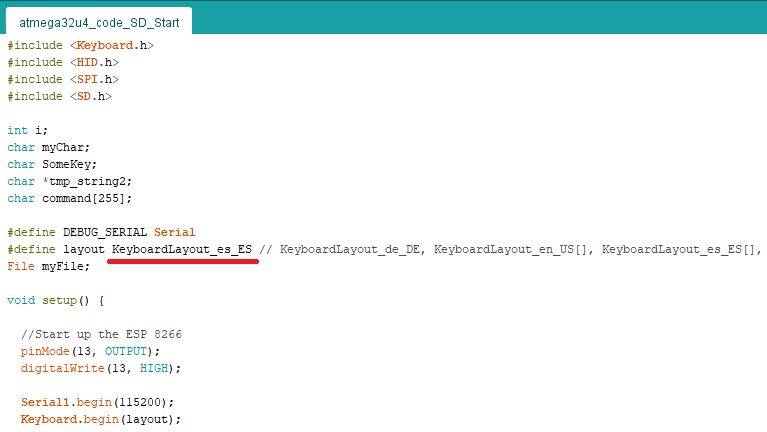
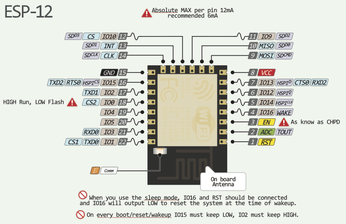

<html>
    <head>
    </head>
    <body>
        <h1>Badusb_Wifi_SD_ExecOnStartUp</h1>
        
Este reporsitorio es una modificacion de: <a href="https://github.com/joelsernamoreno/badusb_sd_wifi">https://github.com/joelsernamoreno/badusb_sd_wifi</a>

        
El hardware utilizado: <a href="https://es.aliexpress.com/item/32839392329.html?spm=a2g0o.order_list.0.0.1875194dMcteUe&amp;gatewayAdapt=glo2esp">https://es.aliexpress.com/item/32839392329.html?spm=a2g0o.order_list.0.0.1875194dMcteUe&amp;gatewayAdapt=glo2esp</a>

        

        

        
Funcionalidades:

        <ol>
            <li>Ejecutar comandos desde el navegador (wifi)</li>
            <li>Ejecutar codigo almacenado en la SD desde un comando Wifi</li>
            <li>Ejecutar el archivo "script.txt" almacenado en la SD, al conectar la USB</li>
            <li>Disponer de un servidor FTP, para poder subir cualquier archivo</li>
            <li>Cambio en la distribicion de teclado: US,ESP...</li>
            <li>Interfaz grafica</li>
        </ol>
        
&nbsp;

        
El proceso esta explicado tanto para linux como para windows

        
Instalacion:

        <ol>
            <ol>
                <li>Descarga el proyecto: <a href="https://github.com/Marcejr117/DM-3212_wifi_SD_ExecOnStart/archive/refs/heads/main.zip">https://github.com/Marcejr117/DM-3212_wifi_SD_ExecOnStart/archive/refs/heads/main.zip</a></li>
                <li>Abre el archivo "esp8266Programmer/esp8266Programmer.ino", modifica las preferencias de arduino y agrega esta linea: <a href="https://raw.githubusercontent.com/SpacehuhnTech/arduino/main/package_spacehuhn_index.json">http://arduino.esp8266.com/stable/package_esp8266com_index.json </a></li>
                <li>Conectamos la tarjeta al pc y configuramos el arduino de la siguiente forma: &nbsp;</li>
                <li>Subimos el sketch a la tarjeta</li>
            </ol>
        </ol>
        

        <ol>
            <li>Desconectamos la tarjeta y puentemos los pines, para poner el esp8266 en modo lectura, en mi caso los dos pines destinados para este fin, se me rompieron, pero estos otros dos pines hacen la misma accion. </li>
            <li>Ahora debemos crear el archivo ".bin" o usar el que ya esta compilado "esp_code\esp_code.ino.generic.bin" en caso de querer compilarlo uno mismo debe de abrir el archivo "esp_code\esp_code.ino" y configurar arduino IDE de la siguiente forma: - Descargamos la placa esp8266 la version 2.3.0:  - seleccionamos la tarjeta "Generic 8266 asi como las siguientes configuraciones":  - copiamos el servidor FTP "esp8266FTPServer-1.0" en la carpeta de librerias que en windows suele estar localizada en "C:\Users\Nombre_Usuario\Documents\Arduino\libraries", en linux: "/Home/Arduino/libraries" - Finalmente lo exportamos a binario y ya tenemos el archivo listo para continuar con el siguiente paso: </li>
            <li>conectamos de nuevo del modulo y dependiendo de si nos encontramos en linux o en windows este metodo cambia, yo recomiendo linux ya que la herramienta permite establezer un "flash_size" de 32Mb y en windows como maximo 16Mb: - Para linux: -- Abrimos un terminal y nos vamos a la carpeta del proyecto "esptool-master_linux" y ponemos el siguiente comando, revisa que la ruta del archivo ".bin" este especificada correctamente:  sudo python esptool.py --port=/dev/ttyACM0 --baud 115200 write_flash 0x00000 ../esp_code/esp_code.ino.generic.bin --flash_size 32m  -- Debemos tener en cuenta que debemos ejecutar el coamndo con python2, puede que necesitemos instalar algunos paquetes mas, en caso de no encontrarlo en google pueden comentarmelo - Para Windows: --debemos abrir la herramienta situada en "esptool-master_Windows" y configuramos de la siguiente forma:   </li>
            <li>Desconectamos la placa y quitamos le modo puente entre los dos pines, abrimos le scketch localizado en: "atmega32u4_code_SD_Start/atmega32u4_code_SD_Start.ino" y configuramos arduino con la placa leonardo, tambien debemos copiar la carpeta "Keyboard-1.0.4" en "C:\Program Files (x86)\Arduino\libraries" en caso de que exista una carpta llamada "Keyboard" la eliminan y copian esta "Keyboard-1.0.4" En caso de que esten en linux debemos localizar la carpeta donde se guardan las librerias.</li>
            <li>Vamos a subir los archivos localizamos en "/HTML" a traves de ftp, para ello es preferible usar linux pero tambien se puede hacer con Filezilla client en windows, es importante usar el modo pasivo y que solo se realize una conexion a la vez, para este punto debemos tener la tarjeta conectada en el equipo y conectados a la red llamada "BadUSB_test" con la contrase&ntilde;a "badUSBWifi": - Linux: --Abrimos una terminal y nos dirijimos a la carpeta "HTML" y ponemos el siguiente comando "pftp -i 192.168.1.1" o tambien "ftp -p -i 192.168.1.1"  --Usuario "esp8266" y contrase&ntilde;a "esp8266"  -- Una vez conectado vamos a subir todo los archivos con el comando "put" como por ejemplo: "put virtualkeyboard.html" uno por uno  - Windows: -- Debemos descargar Filezilla client y configurar un "sitio" para que la conexion sea pasiva, uso exclusivo de FTP y que solo admite una conexion a la vez   -- una vez le damos a conectar ya podemos subir los archivos </li>
            <li>finalmente desconectamos la placa y la volvemos a conectar, nos conectamos a la red "BadUSB_test" contrase&ntilde;a: "badUSBWifi", y accedemos desde la web a la direccion: "192.168.1.1" y tendremos una interfaz grafica desde la que podemos interactuar, cabe destacar que: - Los comandos que mandes desde esta interfaz grafica, se interpretan con el layout ingles - para utilizar la funcionalidad de SD debemos tenerla formateada en "FAT" aun he visto que tambien se podria en "FAT32", debemos crear una archivo llamado "script.txt" (podemos tener mas scripts dentro para poder ejecutarlos posteriormente con el comando "exec archivo.txt" desde la interfaz grafica) - Los script de la SD estan configurados para que se ejecuten con el layout espa&ntilde;ol y los de la interfaz grafica se ejecutan con layout ingles, en caso de quere que los scripts de la SD se ejecuten con layout ingles debemos cambiar esta linea  
            </li>
        </ol>
        <h3>Sintaxis</h3>
        
- print (example: print test) - println (example: println test) - press (example: press KEY_RETURN) - rawpress (example: press KEY_RETURN) - delay (example: delay 1000) - release (example: release) - runwin (example: runwin) - rungnome (example: rungnome) - runmac (example: runmac) - execSD ((example: execSD test.txt, execSD helloworld.txt, execSD remote.txt, etc)

        <h3>Links de apoyo</h3>
        <a href="https://www.arduino.cc/reference/en/language/functions/usb/keyboard/keyboardmodifiers/">Teclas especiales</a> 
        <a href="https://www.arduino.cc/reference/en/language/functions/usb/keyboard/">https://www.arduino.cc/reference/en/language/functions/usb/keyboard/</a> 
        <a href="https://github.com/joelsernamoreno/badusb_sd_wifi">https://github.com/joelsernamoreno/badusb_sd_wifi</a> 
        <a href="https://github.com/Necr0tizing/ArduinoKeyboardLayouts">https://github.com/Necr0tizing/ArduinoKeyboardLayouts</a> 
        <a href="https://github.com/TheMMcOfficial/CJMCU-3212-wifi_ducky">https://github.com/TheMMcOfficial/CJMCU-3212-wifi_ducky</a> 
        <h4>Imagenes de apoyo</h4>
         
          
          
         
    </body>
</html>
